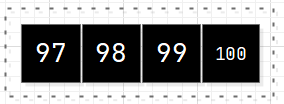
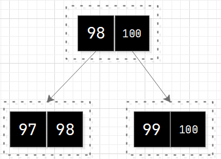
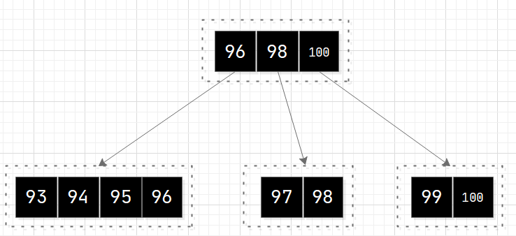
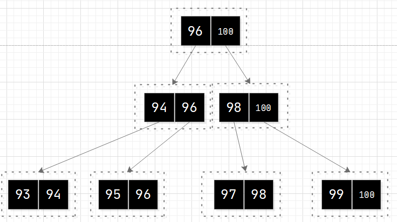
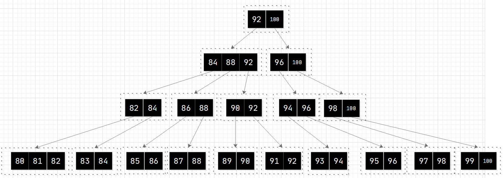

## 1. 概述 
基于nodejs的b+树的实现，目前实现了节点的插入，后续待逐步实现删除。计划在完全实现b+树后，以b+树的基于实现一个kv存储，目前准备完善中！文档后续补上！
</br>

## 2. 运行 
创建数据库，并插入100到80的数据，键和值相同：

```javascript
const bptree = require("./bptree.js");
const constant = require("./const.js");

async function dbTest() {
    let dbname = "test.db"
    let fd = await bptree.init(dbname)
    for (var value = 100; value >= 80; value--) {    // 先定位指针的问题
        let key = Buffer.alloc(constant.KEY_MAX_LEN) // 键值序列化为buf, 小端存储  
        key.fill(0)
        key.writeInt32LE(value)
        await bptree.insert(key, value)
    }
    await bptree.flush(fd)
    //await bptree.close(dbname)
}

dbTest()
```
</br>

## 3. 图解
设计每个页节点，最多可以放入3个数据，order为3  

</br>

### 3.1 页节点结构说明   
页节点的头5个字段分别存储的为页类型、父页节点下标、兄页节点下标、弟叶结点下标、节点内已经填充的数据个数，这个5个字段都是4个字节，以小端模式存储。这5个字段长度的定位在const.js文件中如下：  
```javascript
const PAGE_PARENT_IDX_LEN = 4
const PAGE_PREV_IDX_LEN = 4
const PAGE_NEXT_IDX_LEN = 4
const PAGE_TYPE_LEN = 4 // 页类型：2 ~ 头结点; 1 ~ 茎节点; 0 ~ 页节点
const CELL_USED_LEN = 4
```
从每页的第20（4 * 5）个字节开始, 便存储的是页的具体数据，以键值对（KEY：VAL）的形式，存储的页的数据。其中，若页的类型为2或者1， 则VAL存储的是子节点的页节点下标，若页类型为0，则VAL存储的是具体的数值, 这里设计存储4字节的整形数据，后续可扩展。其中键和值的所占字节长度定义在const.js文件中：   
```javascript
const KEY_MAX_LEN = 10 // 键最大长度
const VAL_IDX_LEN = 4  // 值长度, 根或茎节点指向子页面, 叶子节点指向值
```
为了调试方便，设置页的大小为64，这样，每页中最大的键值对个数为3，即ORDER_NUM，定义在const.js文件中：
```javascript
const PAGE_SIZE = 64 // 页大小
const ORDER_NUM = Math.floor((PAGE_SIZE - PAGE_TYPE_LEN - PAGE_PARENT_IDX_LEN - CELL_USED_LEN - PAGE_PREV_IDX_LEN - PAGE_NEXT_IDX_LEN) / (KEY_MAX_LEN + VAL_IDX_LEN)) // b+树的阶
```
当然，在调试成功之后，可以扩大PAGE_SIZE, 以增加每页可存储的数据。

</br>
<div align=center>
  
</div>
</br>  


### 3.2 页节点存储说明   

</br>

### 3.2 页节点插入数据(选取具有说明性的步骤)  

**a. 插入98:**     
<div align=center>
  
</div> 
</br>

**b. 插入97未分裂:**     
<div align=center>
  
</div> 
</br>

**c. 插入97分裂:**      
节点内数据个数为4， 大于order数目，需要对节点数据分裂，分裂后，左右点数据为97、98，右节点数据为99、100，分别取两个节点的最大值98，100，抽取作为父节点的数据：  
<div align=center>
  
</div> 
</br>

**...... 连续插入(省略)**
</br>

**d. 插入93未分裂:**       
节点内数据个数为4， 大于order数目，需要对节点数据分裂，分裂后，左右点数据为97、98，右节点数据为99、100，分别取两个节点的最大值98，100，抽取作为父节点的数据：  
<div align=center>
  
</div> 
</br>

**e. 插入93分裂:**   
93 ~ 96 四个数据，进行分裂，分裂后，94和96提升到父节点中，父节点的数据为94、96、98、100,父节点数据为4，继续对父节点进行分裂： 
<div align=center>
  
</div>
</br>

**...... 连续插入(省略)**   
</br>

**f. 最后，插入数据80，进行分裂的结果为:**  
<div align=center>
  
</div>
