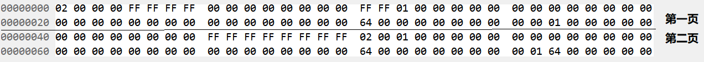

<!-- https://ecotrust-canada.github.io/markdown-toc/ -->
- [1. 说明](#1-说明)
- [2. 目录说明](#2-目录说明)
- [3. 设计及实现](#3-设计及实现)
  - [3.1 b+树](#31-b树)
    - [3.1.1 页结构](#311-页结构)
      - [页节点布局及关系：](#页节点布局及关系)
      - [页节点结构说明:](#页节点结构说明)
      - [页节点存储说明:](#页节点存储说明)
      - [叶结点内存存储:](#叶结点内存存储)
    - [3.1.2 页节点插入数据](#312-页节点插入数据)
    - [3.1.2 叶结点删除](#312-叶结点删除)
    - [3.1.3 叶结点查询](#313-叶结点查询)
    - [3.1.4 空闲节点管理](#314-空闲节点管理)
    - [3.1.5 buffer管理](#315-buffer管理)
  - [3.2 数据表](#32-数据表)
- [4. 测试](#4-测试)
  - [4.1 测试b+树](#41-测试b树)
  - [4.2 测试数据表](#42-测试数据表)

## 1. 说明 
任何一个应用系统中，数据库都处于核心的地位。不管是业务逻辑的设计，系统性能的优化最终都归结于数据库的选型和表设计。而数据库的引擎核心在于b+树，为了厘清b+树的底层原理，我准备从零开始手撸一颗b+树，并计划将来在该b+树的基础上，实现一个简单的kv存储的玩具，如果有机会的话，还可以引入sql的解析，让这个玩具更加逼真。为了劲量的降低开发难度，首先采用nodejs来实现这颗b+树，在原型验证通过之后，可以考虑切换到其他语言。目前已经实现了b+树节点的增删查改、磁盘文件的持久化，其余功能准备完善中！
</br>

## 2. 目录说明
```bash
winston/   # 引用三方日志组件
common/    # 通用包: 包括工具, 缓存管理, 常量定义, 文件操作, page管理基础类等
bptree/    # b+树包
table/     # rdbms 数据库表相关包
data/      # 生成数据库相关文件目录
test/      # 测试程序路径
```
</br>

## 3. 设计及实现
### 3.1 b+树

#### 3.1.1 页结构
 
##### 页节点布局及关系：  

| <!-- -->   | <!-- -->    |
:-------------------------:|:-------------------------:
 |  
| 图1. 页节点内部布局         |  图2. 叶结点之间关系

每个页节点的PARENT存储父节点的节点下标，NEXT存储兄节点的节点下标，PREV存储弟节点的节点下标，若节点类型非页节点，则VAL存储子节点的下标，否则存储具体的数值。  

</br>  

为了调试、说明、理解方便，设计每个页节点，最多可以放入3个数据即order为3，当然实际的b+树页面不可能只存三个数据，可以增加PAGE_SIZE值来增加页面存储数据的个数。当然，在调试成功之后，可以扩大PAGE_SIZE, 以增加每页可存储的数据。   

</br>

##### 页节点结构说明:   
页节点的头6个字段分别存储的为页类型、父页节点下标、兄页节点下标、弟叶结点下标、父节点CELL索引，节点内已经填充的数据个数，前4个字段各4个字节，以小端模式存储，后两个字段各2个字节。这6个字段长度的定位在const.js文件中如下：  
```javascript
const PAGE_TYPE_LEN = 4       // 代表类型的字节数
const PAGE_PARENT_IDX_LEN = 4 // 父节点索引的字节数
const PAGE_NEXT_IDX_LEN = 4   // 兄节点索引的字节数
const PAGE_PREV_IDX_LEN = 4   // 弟节点索引的字节数
const PARENT_CELL_IDX_LEN = 2 // 父节点CELL的索引
const CELL_USED_LEN = 2       // 使用键值数的字节数

```
从每页的第20（4 * 5）个字节开始, 便存储的是页的具体数据，以键值对（KEY：VAL）的形式，存储的页的数据。其中，若页的类型为2或者1， 则VAL存储的是子节点的页节点下标，若页类型为0，则VAL存储的是具体的数值, 这里设计存储4字节的整形数据，后续可扩展。其中键和值的所占字节长度定义在const.js文件中：   
```javascript
const KEY_MAX_LEN = 10 // 键最大长度
const VAL_IDX_LEN = 4  // 值长度, 根或茎节点指向子页面, 叶子节点指向值
```

其中，VAL包括两个部分(type: value), type即为数据的类型， value为数据的实际值，type的定义在const.js中:
```javascript
const VAL_TYPE_IDX = 0 // 非叶子节点存储子节点索引
const VAL_TYPE_NUM = 1 // 叶子节点存储内容为数字
const VAL_TYPE_STR = 2 // 叶子节点存储内容为字符串
const VAL_TYPE_FPN = 3 // 叶子节点存储内容为浮点数
const VAL_TYPE_OBJ = 4 // 叶子节点存储内容为对象
const VAL_TYPE_UNK = 5 // 未知
```


为了调试方便，设置页的大小为64，这样，每页中最大的键值对个数为3，即ORDER_NUM，定义在const.js文件中：
```javascript
const PAGE_SIZE = 64 // 页大小
const PAGE_TYPE_OFFSET = 0    // 页类型页内偏移
const PAGE_PARENT_OFFSET = PAGE_TYPE_OFFSET + PAGE_TYPE_LEN       // 页类型页内偏移
const PAGE_NEXT_OFFSET = PAGE_PARENT_OFFSET + PAGE_PARENT_IDX_LEN // 父索引页内偏移
const PAGE_PREV_OFFSET = PAGE_NEXT_OFFSET + PAGE_NEXT_IDX_LEN     // 兄索引页内偏移
const PARENT_CELL_OFFSET = PAGE_PREV_OFFSET + PAGE_PREV_IDX_LEN   // 父节点CELL索引偏移
const CELL_USED_OFFSET = PARENT_CELL_OFFSET + PARENT_CELL_IDX_LEN // 弟索引页内偏移
const CELL_OFFSET = CELL_USED_OFFSET + CELL_USED_LEN              // 存KV值的页内偏移
const HEAD_LEN = CELL_OFFSET  

const CELL_LEN = KEY_MAX_LEN + VAL_IDX_LEN                        // 每一对KV的长度

const ORDER_NUM = Math.floor((PAGE_SIZE - HEAD_LEN) / CELL_LEN)   // b+树的阶
const LESS_HALF_NUM = Math.floor(ORDER_NUM / 2)  // 少的一半
const MORE_HALF_NUM = Math.ceil(ORDER_NUM / 2)   // 多的一半

```

##### 页节点存储说明:
数据按页连续存入单文件中，第1页的范围为0-63byte, 页下标为0，第2页的范围为64-127byte，页下标为1，依次内推，以插入数据100为例，存储文件以16进制dump出来显示如下：  
<div align=center>
  
</div>
&nbsp;&nbsp;&nbsp;&nbsp;结合页存储布局图可见，第1页的类型为2，说明是根节点，其兄、弟节点索引都是0xFFFFFFFF代表无所指，USED字段值为0，代表数据节点有1个被用，已知设计叶结点的数据从小到大排列，这里只有1个数据(100, 十六进制0x64)，故而把100存在下标为ORDER_NUM - 1 的位置，因为设计页的ORDER_NUM为3，故而100存在下标为2的位置，由前面的说明知道，键长度为10，这里如图即为：64 00 00 00 00 00 00 00 00 00(代表键100), 而值长度为4，这里如图即为: 01 00 00 00(代表值1)，因为本页为根节点，所以这里的1代表子节点的下标为1即第二页.   
</br>
&nbsp;&nbsp;&nbsp;&nbsp;第2页的类型为0，说明是叶节点，其父节点为0，代表其父节点为第1页，USED字段值为1，代表数据节点有1个被用，由前面的说明知道，把100存在下标为ORDER_NUM - 1 的位置，键长度为10，这里如图即为：64 00 00 00 00 00 00 00 00 00(代表键100), 而值长度为4，这里如图即为: 64 00 00 00(代表值100)，因为本页为页节点，所以这里的64代表具体的数值.  

</br>

##### 叶结点内存存储:

借助于nodejs的特性，以map存储页的索引以及对应的页内容，定义在bptree.js文件中：
```javascript
var rootPage = undefined // 根页面
const pageMap = {} // 页节点表

fucntion newPage(type) {
    var cells = []
    for (var index = 0; index < ORDER_NUM; index++) {
        var cell = this.newCell()
        cells.push(cell)
    }

    return {
        type: type,        // 页类型：2 ~ 根, 1 ~ 中间节点, 0 ~ 叶子节点
        parent: -1,         // 父节点
        next: -1,           // 兄节点
        prev: -1,           // 弟节点 
        pcell: -1,          // 父节点 cell索引
        used: 0,
        cells: cells,
    }
}
```

</br>

#### 3.1.2 页节点插入数据 
(选取具有说明性的步骤) 
</br>

**a. 插入98:**     
<div align=center>
  
</div> 
</br>

**b. 插入97未分裂:**     
<div align=center>
  
</div> 
</br>

**c. 插入97分裂:**      
节点内数据个数为4， 大于order数目，需要对节点数据分裂，分裂后，左右点数据为97、98，右节点数据为99、100，分别取两个节点的最大值98，100，抽取作为父节点的数据：  
<div align=center>
  
</div> 
</br>

**...... 连续插入(省略)**
</br>

**d. 插入93未分裂:**       
节点内数据个数为4， 大于order数目，需要对节点数据分裂，分裂后，左右点数据为97、98，右节点数据为99、100，分别取两个节点的最大值98，100，抽取作为父节点的数据：  
<div align=center>
  
</div> 
</br>

**e. 插入93分裂:**   
93 ~ 96 四个数据，进行分裂，分裂后，94和96提升到父节点中，父节点的数据为94、96、98、100,父节点数据为4，继续对父节点进行分裂： 
<div align=center>
  
</div>
</br>

**...... 连续插入(省略)**   
</br>

**f. 最后，插入数据80，进行分裂的结果为:**  
<div align=center>
  
</div>

#### 3.1.2 叶结点删除
TODO

</br>

#### 3.1.3 叶结点查询
TODO

</br>

#### 3.1.4 空闲节点管理
TODO

</br>

#### 3.1.5 buffer管理
TODO

</br>

### 3.2 数据表
TODO

</br>

## 4. 测试
测试的demo文件在test目录下面，test_bptree.js用于测试b+树，test_table.js用于测试数据库, 直接执行:
```bash
node test_bptree.js  # 测试b+树
node test_tables.js  # 测试表
```
测试生成的数据，存储在data目录，在任何路径下执行test_bptree.js、test_tables.js的数据都放在根目录下的data目录

</br>

### 4.1 测试b+树
```javascript
const { PAGE_SIZE } = require('../common/const');
const winston = require('../winston/config');
const Bptree = require("../bptree/bptree");
const tools = require('./test_tools');
const assert = require('assert');

async function test0() {
    let bptree = new Bptree(4)
    let dbname = "test.db"
    await bptree.drop(dbname)
    await bptree.init(dbname)
    await tools.writeRange(bptree, 1000, 1)
    await bptree.flush()
    let value = await tools.find(bptree, 100)
    assert.equal(value, 100)
    winston.error(`$$ the buffer's final size is: ${bptree.getBuffer().buffSize()}`)
    await bptree.close()
}

async function test1() {
    let bptree = new Bptree(2)
    let dbname = "test.db"
    await bptree.drop(dbname)
    await bptree.init(dbname)

    await tools.writeRange(bptree, 100, 97)
    await tools.removeAny(bptree, [100, 99, 98, 97])
    await tools.writeOne(bptree, 100, 100)
    await tools.writeOne(bptree, 99, 99)

    let value = await tools.find(bptree, 100)
    assert.equal(value, 100)

    value = await tools.find(bptree, 98)
    assert.equal(value, undefined)

    await bptree.flush()
    await bptree.close()
}

async function test2() {
    let bptree = new Bptree(300)
    let dbname = "test.db"
    try {
        await bptree.drop(dbname)
    } catch (e) {
        winston.warn(`drop error!`)
    }

    await bptree.init(dbname)

    await tools.writeRange(bptree, 100000, 0)

    for (var i = 0; i < 100000; i++) {
        let value = await tools.find(bptree, i)
        assert.equal(value, i)
    }

    await bptree.flush()
    winston.error(`$$ the buffer's final size is: ${bptree.getBuffer().buffSize()}`)
    await bptree.close()
}

async function test3() {
    let bptree = new Bptree(10)
    let dbname = "test.db"
    try {
        await bptree.drop(dbname)
    } catch (e) {
        winston.warn(`drop error!`)
    }

    await bptree.init(dbname)

    await tools.writeRange(bptree, 0, 1000)
    for (var i = 0; i < 1000; i++) {
        let value = await tools.find(bptree, i)
        assert.equal(value, i)
    }

    await tools.removeRange(bptree, 0, 1000)
    winston.error(`$$ the buffer's final size is: ${bptree.getBuffer().buffSize()}`)
    await bptree.flush()
    await bptree.close()
}

/* dynamic data insert and delete test! */
async function test4() {
    let bptree = new Bptree(50)
    let array = []
    let number = array.length > 0 ? array.length : 1000
    if (array.length == 0) {
        for (var i = 0; i < number; i++) {
            array.push(tools.random(0, 1000))
        }
    }
    winston.error(array)

    let dbname = "test.db"
    try {
        await bptree.drop(dbname)
    } catch (e) {
        winston.warn(`drop error!`)
    }

    await bptree.init(dbname)
    await tools.writeAny(bptree, array)

    for (var i = 0; i < number; i++) {
        let key = array[i]
        let value = await tools.find(bptree, key)
        winston.error(`# find: key:${key} => value:${value}`)
        assert.equal(value, key)
    }

    await tools.removeAny(bptree, array)
    await bptree.flush()
    await bptree.close()
}

async function test5() {
    let bptree = new Bptree(50)
    let array = []
    let number = array.length > 0 ? array.length : 1000
    if (array.length == 0) {
        for (var i = 0; i < number; i++) {
            array.push(tools.random(0, 1000))
        }
    }
    winston.info(array)

    let dbname = "test.db"
    try {
        await bptree.drop(dbname)
    } catch (e) {
        winston.warn(`drop error!`)
    }

    await bptree.init(dbname)
    await tools.writeAny(bptree, array)

    for (var i = 0; i < number; i++) {
        let key = array[i]
        let value = await tools.find(bptree, key)
        winston.info(`# find: key:${key} => value:${value}`)
        assert.equal(value, key)
    }

    for (var i = 0; i < number; i++) {
        let pos = tools.random(0, array.length - 1)
        let key = array[pos]
        let value = await tools.removeOne(bptree, key)
        array.splice(pos, 1)
    }

    await bptree.flush()
    await bptree.close()
}

/* 测试value为字符串 */
async function test6() {
    let bptree = new Bptree(3, 1024, 9, 100)
    let dbname = "test.db"
    await bptree.drop(dbname)
    await bptree.init(dbname)
    await tools.writeOne(bptree, 100, 'hello world')
    await bptree.flush()
    let value = await tools.find(bptree, 100)
    assert.equal(value, 'hello world')
    await bptree.close()
}

/* 测试value为浮点数 */
async function test7() {
    let bptree = new Bptree(3)
    let dbname = "test.db"
    await bptree.drop(dbname)
    await bptree.init(dbname)
    await tools.writeOne(bptree, 100, 1.2345)
    await bptree.flush()
    let value = await tools.find(bptree, 100)
    winston.error(`## map[100] = ${value}`)
    await bptree.close()
}

async function test8() {
    let bptree = new Bptree(100, PAGE_SIZE, 4, 6)
    let dbname = "test.db"
    await bptree.drop(dbname)
    await bptree.init(dbname)

    let buff = Buffer.alloc(6)
    buff.writeUInt32LE(10, 0)
    buff.writeUInt16LE(1, 4)

    await tools.writeOne(bptree, 100, buff)
    await bptree.flush()
    let value = await tools.find(bptree, 100)

    let pageIndex = value.readUInt32LE()
    let slotIndex = value.readUInt16LE(4)

    winston.error(`## pageIndex = ${pageIndex}, slotIndex= ${slotIndex}`)

    await bptree.close()
}

const funcList = [
    test0,
    test1,
    test2,
    test3,
    test4,
    test5,
    test6,
    test7,
    test8,
]

async function test() {
    for (var i = 0; i < funcList.length; i++) {
        func = funcList[i]
        winston.error(`>>>>>>>>>(${func.name})`)
        await func()
        winston.error(`<<<<<<<<<(${func.name})`)
    }
}

test()

```
</br>

### 4.2 测试数据表
```javascript
const winston = require('../winston/config');
const Table = require("../table/table.js")
const Column = require("../table/column")
const assert = require('assert');


// 数据插入表中，并读取测试，作为测试，索引添加在AID之上, 索引尚不可配置
async function test0() {
    let tbname = "test"
    let columns = []
    col0 = new Column("AID", 0, undefined, 1, "key0")
    col1 = new Column("name", 2, 32, 0, undefined)    // 最大长度为32
    col2 = new Column("age", 0, undefined, 0, undefined)

    columns.push(col0)
    columns.push(col1)
    columns.push(col2)

    let table = new Table(tbname, columns, 500)
    await table.drop()
    await table.init()

    let value = [1, "lihan", 38]

    await table.insert(value)

    let row = await table.selectById(1)

    let nameBuff = Buffer.alloc(32)
    row.copy(nameBuff, 0, 4, 36)
    let name = nameBuff.toString().replace(/^[\s\uFEFF\xA0\0]+|[\s\uFEFF\xA0\0]+$/g, "")
    let age = row.readUInt32LE(36)
    
    winston.error(`##name = ${name}, age = ${age}`)

    await table.flush()
    await table.close()
}

const funcList = [
    test0,
]

async function test() {
    for (var i = 0; i < funcList.length; i++) {
        func = funcList[i]
        winston.error(`>>>>>>>>>(${func.name})`)
        await func()
        winston.error(`<<<<<<<<<(${func.name})`)
    }
}

test()

```


